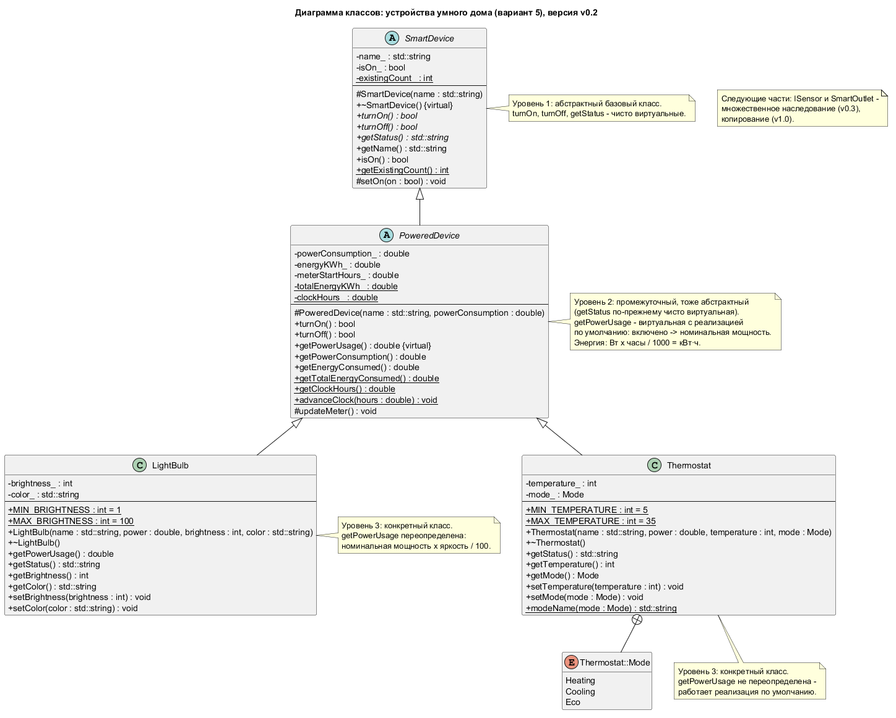

# Лабораторная работа №4 по ООП

[](https://github.com/Vareshka86/Lab4_OOP_try1/releases)

Иерархия устройств умного дома с наследованием на C++14 — консольная программа по лабораторной работе №4.

Программа выполняет [лабораторную работу №4](https://aleksandr-003.github.io/labs/OOP_z/Labs1_4.html) курса «Объектно-ориентированное программирование и проектирование» (А. Д. Смородинов), вариант 5 — «Устройства умного дома». Работа сдаётся по частям: каждая часть выходит отдельной версией. Сейчас выполнены части 1 и 2 из 4: иерархия SmartDevice → PoweredDevice → LightBulb и Thermostat, учёт потреблённой энергии, массив устройств через указатели на базовый класс и отдельный файл с тестами.

```console
$ .\build\lab4.exe
...
==================== Тест 6. Массив устройств через указатели на базовый класс ====================
SmartDevice* devices[4] = {
    new LightBulb("Кухня", 60.0, 100, "тёплый белый"),
    new Thermostat("Спальня", 1500.0, 22, Thermostat::Mode::Heating),
    new LightBulb("Коридор", 40.0, 50, "белый"),
    new Thermostat("Кабинет", 1000.0, 24, Thermostat::Mode::Cooling)};
  [OK]     создано 4 устройства

for (SmartDevice* device : devices) device->turnOn();
  [OK]     включены все 4 устройства
PoweredDevice::advanceClock(2.0);   // модельное время: 16.0 ч
for (SmartDevice* device : devices) device->turnOff();
Статистика:
  Лампа «Кухня»: выключена, яркость 100 %, цвет «тёплый белый», мощность сейчас 0.0 Вт из 60.0 Вт, засчитано 0.120 кВт·ч
  Термостат «Спальня»: выключен, режим «обогрев», температура 22 °C, мощность сейчас 0.0 Вт из 1500.0 Вт, засчитано 3.000 кВт·ч
  Лампа «Коридор»: выключена, яркость 50 %, цвет «белый», мощность сейчас 0.0 Вт из 40.0 Вт, засчитано 0.040 кВт·ч
  Термостат «Кабинет»: выключен, режим «охлаждение», температура 24 °C, мощность сейчас 0.0 Вт из 1000.0 Вт, засчитано 2.000 кВт·ч
  [OK]     после выключения ни одно устройство не включено
Общая энергия выросла на 5.160 кВт·ч
  [OK]     общий счётчик: (60 + 1500 + 20 + 1000) Вт × 2 ч = 5.160 кВт·ч
...
==================== Итог ====================
Проверок пройдено: 41 из 41
Устройств сейчас: 0
Модельное время: 16.0 ч
Всего засчитано энергии: 5.910 кВт·ч
```

*Массив указателей на абстрактный SmartDevice хранит лампы и термостаты; один и тот же вызов `device->getStatus()` выводит строку нужного класса. Остальной вывод тестов сокращён до `...`.*



*Диаграмма классов в PlantUML (исходник — `uml/SmartHome.puml`).*

## Части работы

| № | Что требуется | Версия | Статус |
|---|---------------|--------|--------|
| 1 | Иерархия из 3 уровней SmartDevice → PoweredDevice → LightBulb; чисто виртуальные функции, виртуальная `getPowerUsage()` с реализацией по умолчанию; статический счётчик кВт·ч и `getTotalEnergyConsumed()`; файл тестов | [v0.1](https://github.com/Vareshka86/Lab4_OOP_try1/releases/tag/v0.1) | Выполнено |
| 2 | Thermostat (температура, режим); массив устройств через указатели на базовый класс | [v0.2](https://github.com/Vareshka86/Lab4_OOP_try1/releases/tag/v0.2) | Выполнено |
| 3 | Множественное наследование: интерфейс ISensor и SmartOutlet (розетка + датчик) | — | Запланировано |
| 4 | Конструкторы копирования и присваивание с учётом состояния; полный набор тестов | — | Запланировано |

## Требования

- Компилятор g++ с поддержкой C++14. Проверено на g++ 16.2.0 (MinGW-w64, Windows 11).
- Doxygen — для сборки документации, необязательно. Проверено на версии 1.18.0.
- PlantUML — чтобы перерисовать диаграмму классов, необязательно. Проверено на версии 1.2026.8 (Java 8).

## Установка

```bash
git clone https://github.com/Vareshka86/Lab4_OOP_try1.git
cd Lab4_OOP_try1
```

Без git: откройте [Releases](https://github.com/Vareshka86/Lab4_OOP_try1/releases), скачайте архив **Source code (zip)** нужной версии и распакуйте его. Обновить клонированный репозиторий: `git pull`.

## Сборка и запуск

**Windows** (cmd или PowerShell):

```console
$ .\build.bat
Сборка успешна: build\lab4.exe
```

```powershell
.\build\lab4.exe
```

Что произошло:

- `build.bat` собрал программу из файлов папки `src` с флагами `-std=c++14 -Wall -Wextra -pedantic -static`; предупреждений компилятора нет.
- Программа выполнила все тесты и вывела итог; в конце она ждёт нажатия Enter, чтобы окно не закрылось сразу. Код возврата 0 — все проверки пройдены, 1 — есть ошибки.

**Linux и macOS** — на этих системах сборка не проверялась:

```bash
g++ -std=c++14 -Wall -Wextra -pedantic -Iinclude src/*.cpp -o lab4
./lab4
```

## Как это работает

SmartDevice — абстрактный базовый класс: имя, состояние «включено/выключено» и чисто виртуальные `turnOn()`, `turnOff()`, `getStatus()`. PoweredDevice добавляет номинальную мощность, реализует включение и выключение с учётом энергии и объявляет виртуальную `getPowerUsage()` с реализацией по умолчанию; `getStatus()` у него по-прежнему чисто виртуальная, поэтому он тоже абстрактный. LightBulb — конкретный класс: яркость и цвет, мощность пропорциональна яркости.

Время в программе модельное: статический метод `PoweredDevice::advanceClock()` сдвигает часы. При выключении устройство засчитывает энергию «ватты × часы / 1000» себе и общему статическому счётчику кВт·ч, который возвращает статическая функция `getTotalEnergyConsumed()`. Деструктор SmartDevice виртуальный, поэтому `delete` через указатель на базовый класс уничтожает объект полностью; деструктор лампы выключает её, и энергия последнего интервала не теряется.

Thermostat — второй конкретный класс: заданная температура от 5 до 35 °C и режим (`enum class Mode`: обогрев, охлаждение, эко). `getPowerUsage()` он не переопределяет, поэтому работает реализация по умолчанию из PoweredDevice — так в иерархии видны и переопределение (лампа), и версия базового класса (термостат). Тест 6 создаёт через `new` массив `SmartDevice* devices[4]` из ламп и термостатов, включает и выключает их в цикле, выводит статистику и сверяет общий счётчик энергии, а затем удаляет устройства через указатели на базовый класс.

Тесты вынесены в отдельный файл `tests.cpp`: создание объектов, полиморфные вызовы, учёт энергии и статические члены, исключения при неверных параметрах, виртуальный деструктор, массив устройств. Подробное описание — на страницах [«Часть 1. Иерархия из трёх уровней и учёт энергии»](pages/part1.md) и [«Часть 2. Термостат и массив устройств»](pages/part2.md).

## Документация

Комментарии в коде оформлены для Doxygen. Соберите документацию:

```bash
doxygen Doxyfile
```

Откройте `docs/html/index.html`. Сборка проходит без предупреждений. Диаграмма классов в документации — готовая картинка `uml/SmartHome.png`, поэтому для сборки документации PlantUML не нужен. Перерисовать картинку после правки `uml/SmartHome.puml`:

```bash
java -jar plantuml.jar -charset UTF-8 -tpng uml/SmartHome.puml
```

Что изменилось в каждой версии — в [CHANGELOG.md](CHANGELOG.md).

## Версии

Каждая часть выполняется в отдельной ветке (`part1`, …), исправления — в ветках `fix-…`. Готовая ветка сливается в `main`, и на результат ставится метка версии: [список версий](https://github.com/Vareshka86/Lab4_OOP_try1/releases).

---

Выполнил: Vareshka86.
